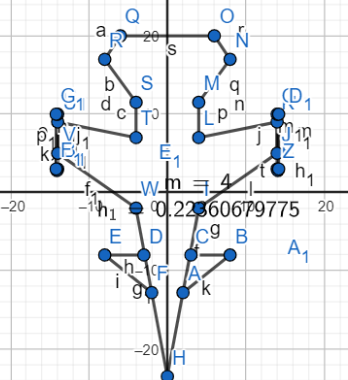
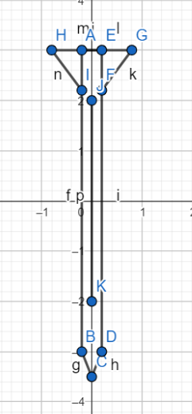
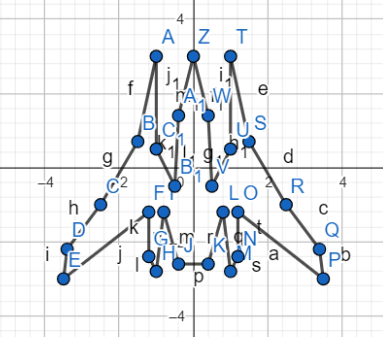
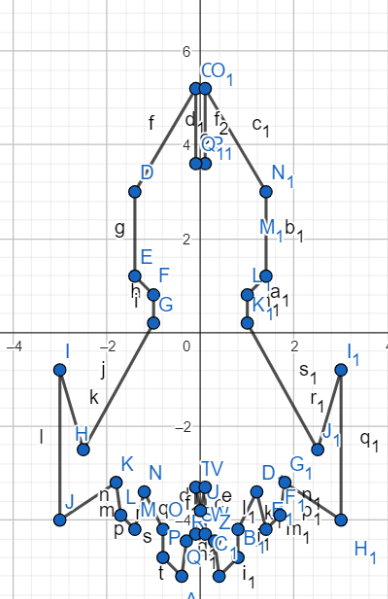

# 👾 INVASION: Retro C++ Space Shooter
### (Built entirely with `graphics.h`)

---

## 🎥 Video Demonstrasi Gameplay
Di bawah ini adalah rekaman *gameplay* nyata dari INVASION. Anda dapat melihat mekanik pergerakan, penembakan peluru (*machine gun*), peluncuran rudal, serta _sound effect_ saat permainan berlangsung.

https://github.com/user-attachments/assets/b1393997-a294-4581-8fd2-ef460983302e

---

## 📖 Latar Belakang & Konsep
**INVASION** adalah permainan tembak-menembak bernuansa luar angkasa (*space shooter*) yang menceritakan tentang pertempuran antara armada bumi melawan koloni alien yang mencoba melakukan invasi besar-besaran.

Hal yang membuat proyek ini istimewa adalah pengembangannya yang murni menggunakan pustaka C++ klasik, yaitu **`graphics.h`**. Meskipun pustaka ini tergolong sangat tradisional (dan sering dianggap usang dibandingkan API grafis modern seperti OpenGL atau DirectX), proyek ini membuktikan bahwa pemahaman matematis, alokasi memori, dan pemrograman tingkat rendah dapat digunakan untuk membangun arsitektur *game* interaktif yang berkinerja tinggi.

---

## 🎨 Seni Grafis & Desain Pixel Art
Visual dalam INVASION menggabungkan pesona klasik *Pixel Art* dengan komputasi matematis *graphics.h*:

- **Karakter & Musuh (Pixel Art):** Aset visual seperti pesawat manusia (pemain), armada alien, dan kotak *buff* dirancang menggunakan perangkat lunak pihak ketiga khusus *Pixel Art*. Aset ini kemudian dimuat ke dalam *game* menggunakan fungsi `readimagefile` dan dirender ulang ke koordinat dinamis layar permainan secara berulang menggunakan kombinasi fungsi memori `getimage` dan `putimage`.
- **Amunisi & Proyektil (Geometri):** Khusus untuk peluru (kaliber .50) dan desain rudal pelacak, pengembang merepresentasikannya sebagai gabungan presisi dari banyak garis menggunakan fungsi bawaan `line(x1, y1, x2, y2)`. Koordinat titik ini dipetakan terlebih dahulu menggunakan bantuan **GeoGebra** untuk menemukan relasi geometris yang akurat sebelum di- *hardcode* ke dalam C++.

### 1. Pesawat Manusia (Player) & Senjata
Pemain mengendalikan jet tempur utama yang dapat menembakkan senapan mesin (klik kiri) atau meluncurkan misil jarak jauh (klik kanan).

  
  

### 2. Armada Alien (Enemies)
Pesawat alien akan memunculkan rentetan serangan dengan pola pergerakan dan kecepatan yang ter-acak (*randomized*). Terdapat dua tipe pesawat alien utama (*Pixel Art*) dengan bentuk yang berbeda:

  
  

---

## ⚙️ Implementasi Teknis & Algoritma
Proyek ini mengimplementasikan konsep-konsep *Object Oriented Programming* (OOP) tingkat dasar untuk mengelola entitas yang bergerak secara kontinu di atas kanvas:
1. **Sistem Penggambaran Karakter Bawaan C++ (`getimage` & `putimage`):** Menggunakan alokasi memori manual (`malloc()`) untuk menyimpan tangkapan kanvas (*bitmap*) ke dalam RAM (*pointer*), lalu merendernya ulang ke posisi layar baru. Teknik ini sangat ringan untuk karakter yang bergerak dinamis dibandingkan menggunakan `readimagefile()` yang lambat.
2. **Sistem Hitbox (Deteksi Tabrakan):** Menggunakan pembatasan geometri tak kasat mata (kotak transparan) di sekitar pesawat pemain maupun alien. Tabrakan antara peluru dan *hitbox* alien akan memicu fungsi ledakan dan memunculkan *buff item* (seperti darah atau peluru misil tambahan).
3. **Mekanik Gameplay:** Meliputi bar perhitungan Nyawa (*Health Point*), Penghitung Skor dinamis, _Sound Effect_ (*missile* dan peluru), layar pemuatan (_Loading Screen_), dan navigasi antarmuka _Main Menu_.

---

## 🚀 Cara Bermain
1. **Kompilasi:** Pastikan *IDE* Anda (seperti Dev C++ atau Code::Blocks) telah dikonfigurasi untuk menjalankan pustaka `graphics.h` (menggunakan ekstensi Borland BGI).
2. **Kontrol:** 
   - Arahkan _mouse_ (kursor) untuk menggerakkan pesawat.
   - **Klik Kiri:** Menembakkan senapan mesin tanpa batas.
   - **Klik Kanan:** Meluncurkan rudal pelacak (memerlukan ketersediaan amunisi rudal).
3. **Objektif:** Hancurkan kapal induk musuh dan ambil kotak *buff* (hati untuk memulihkan *HP*, roket untuk amunisi misil) untuk bertahan hidup hingga akhir!

---
## 👨‍💻 Kontributor
**Ali Akbar Alhabsyi (ali1140)**  
Departemen Teknik Komputer, Institut Teknologi Sepuluh Nopember (2025). Menggali nilai estetika *Pixel Art* secara matematis menggunakan paradigma *C++ Object Oriented Programming*.
